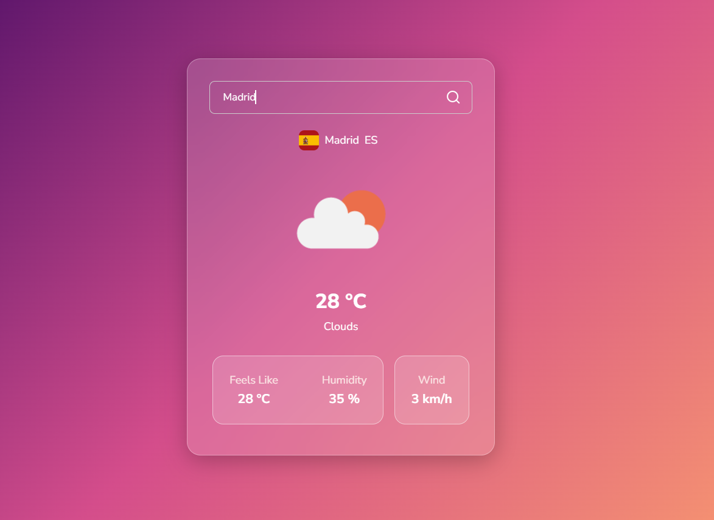

# 🌤️ Mini Weather App

**Mini Weather App** is a beginner-friendly web project that allows users to search for **any city in the world** and view **real-time weather data** using the **OpenWeather API**.

This app is built with **HTML, CSS, and vanilla JavaScript**, and it’s perfect for beginners who want to practice API integration, form handling, and DOM manipulation.

---

## 📄 Project Description

This weather application is a simple and clean web tool that lets users enter a city name and instantly fetch the latest weather details such as:

- Temperature
- Weather conditions (like Clear, Rain, Snow, etc.)
- Humidity
- Wind speed
- Country info

By building this app, beginners will learn how to make HTTP requests using JavaScript, handle user input, and work with dynamic API data.

---

## 📸 Screenshot

  
> _Add your actual image to the `/` folder and update the filename if needed._

---

## 🔧 Tech Stack

- **HTML** – Structure
- **CSS** – Styling and layout
- **JavaScript** – Logic and API handling
- **OpenWeather API** – Real-time weather data source  
  🔗 [https://openweathermap.org/api](https://openweathermap.org/api)

---

## 🔍 Features

- 🌍 Search weather for **any city in the world**
- 📡 Get **live weather data** (temperature, humidity, wind, etc.)
- 🔁 Real-time API fetching using `fetch()`
- 👶 Beginner-focused code structure
- 📱 Responsive and mobile-friendly layout

